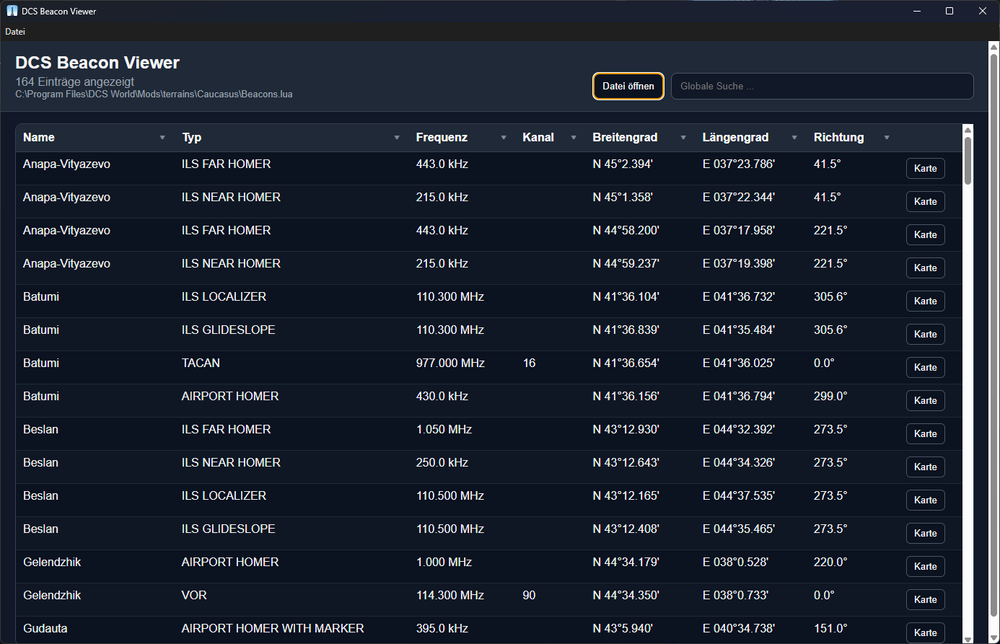

# 🛰️ DCS Beacon Viewer

Desktop-Viewer für die `beacons.lua`-Dateien aus **DCS World**.  
Die Anwendung ermöglicht es, Navigationsbeacons übersichtlich darzustellen, zu filtern und die Position auf Google-Maps anzuzeigen.

---
## ⬇️ Download

[➡️ Zum neuesten Release](https://github.com/sivar2311/dcs-beacon-viewer/releases/latest)

---

## 📸 Screenshot

*Beispiel: Beacons der Caucasus Map*

---

## ✨ Features

### 🔍 Übersichtliche Darstellung
- Anzeige aller Beacons in einer strukturierten Tabelle
- Fokus auf die wichtigsten Daten:
  - Name
  - Typ
  - Frequenz
  - Channel
  - Latitude / Longitude
  - Direction

---

### 🎛️ Erweiterte Filterfunktionen
- Excel-ähnliche Filter pro Spalte
- Auswahl per Checkbox (Mehrfachauswahl möglich)
- Schnelles Ein-/Ausblenden von Werten
- Kombination mehrerer Filter gleichzeitig

---

### 🔎 Globale Suche
- Durchsucht alle sichtbaren Spalten gleichzeitig

---

### 🔃 Sortierung
- Sortierung direkt über Filter-Menü (auf-/absteigend)
- Kombinierbar mit Filtern

---

### 🗺️ Kartenintegration
- Jede Zeile besitzt einen **„Show“-Button**

---